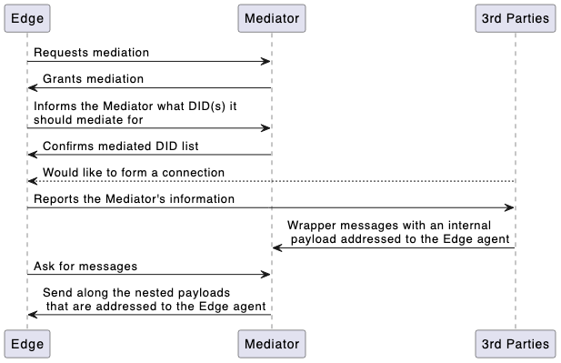

# Routing 

Mediation is the process of relaying messages from a sender to a recipient, through one or more intermediate steps. These steps are called mediators. Mediators allow for reliability in message delivery and enhanced privacy for network-challenged agents. 

Different types of mediators exist, thought the most common is an Inbound Mediator. Other mediator types are discussed in Advanced Topics.

## Why Do We Need Mediation?
To understand why mediators exist, we must first distinguish between different types of agents. Two primary kinds of agents exist, cloud agents and edge agents. Cloud agents, as their name implies, exist in the cloud. A primary characteristic of these agents is a fixed endpoint for communication. Edge agents include devices such as smartphones, personal computers, and other mobile devices. Such devices have ephemeral addresses and cannot be reliably communicated with at a specific endpoint. <link to more detailed descr of agent types?> 

Mediators primarily exist to bridge the gap between cloud agents and edge agents. A mediator has a persistent, fixed endpoint that can be accessed by edge agents and cloud agents alike. Edge agents who are granted mediation can report the mediator's information to other agents. These other agents can then send messages to the mediator's fixed endpoint, and the mediator will either pass them along to the mediated client or hold on to them until the client picks them up. 

### Sidebar: Mediator vs. Relay
This concept of mediation has existed for as long as DIDComm has. Historically, agents that relayed messages have been referred to as mediators. However, the term "mediator" implies a level of authority in a given interaction, and these agents have no inherent authority. The term "relay" has relatively recently been proposed as a replacement, more accurately capturing the unopinionated, unauthoritative nature of these agents. 
In a future version of the DIDComm standard, "relay" will likely replace "mediator" as the official term. However, "mediator" has been used here to avoid confusion with the current specification.

## How Does Mediation Work?

As we've mentioned mediators typically exist to serve as a stand-in for a missing fixed endpoint for edge agents. Inbound relays can exist as public entities, serving any edge agent who requests mediation, or they can be configured to only relay messages for approved edge agents.

### Inbound Mediation Flow

### The Forward Message
The core of inbound mediation is the `forward` message. Simply put, forward messages are wrappers, addressed and encrypted to mediators, with an additional payload that is encrypted for the ultimate recipient. This allows messages of any type to be passed to and through a mediator, without a strong degree of trust in the mediator. The mediator is incapable of reading the encrypted payload. 
Mediators can be configured to rewrap messages. In this case, rather than delivering the original (opaque) payload directly to the recipient, they can wrap the payload in another `forward` message. This preserves the original size of the message received by the mediator, but more importantly, it allows mediators to be chained in arbitrary lengths; as long as all the mediators know to rewrap messages, and which mediator is next in the chain, a message can pass through any number of mediators until it arrives at its final destination.

# Advanced Mediator Topics

## Duplicate Mediators
### For Reliability
Mediators are designed to improve the reliability of message delivery, but like all software deployments, there's always risk of downtime. One way to mitigate that risk and to help insure that messages arrive to your agent promptly is to set up multiple mediators. 
A mobile agent can configure arbitrarily many mediators to relay messages for it. Invitations can be configured with multiple endpoints, arranged in order of preference, which are then reported to third parties like normal. Connections to your agent should attempt to deliver their messages to the mediator you specify as your primary endpoint. However, if the message is undeliverable, due to downtime in that mediator, they can try again, sending the message to the other mediators, according to the specified preference, until the message is deliverable. 

### For Message Tracking
It may be desirable to know where messages are coming from, and one way to do that it by setting up multiple mediators. If you have multiple mediators set up, you can keep track of which messages arrive from which mediator. 
As an example, you might have one mediator set up for high-priority connections, which you enable live delivery from as often as you are able, and a second mediator for lower priority connections or messages, and you only poll for messages occasionally, at some predetermined interval.
    
## Additional Types of Mediators

### Outbound Mediator
Outbound mediators exist to obscure the sender of a message. A sender can send a message to an outbound mediator, which then actively sends along the message to the intended recipient. The recipient then sees the outbound mediator as the sender of the message, rather than the actual sender.

### Hidden Mediator
A hidden mediator is a mediator that is unknown to the sender. Inbound mediators are known to be mediators, and thus senders will wrap messages in `forward` messages. With a hidden mediator, senders will simply pack messages to the hidden mediator directly, not wrapping their messages as `forward` messages. 
This requires a close coupling of mediator-to-agent and a high degree of trust. Typically, a hidden mediator will be deployed with another agent's deployment. This can be useful to bypass issues with exposing endpoints of agents behind firewalls. Hidden mediators can also be instantiated between an inbound mediator and an agent that is incapable of polling for messages from said inbound mediator, allowing such an agent to use an inbound mediator. 
